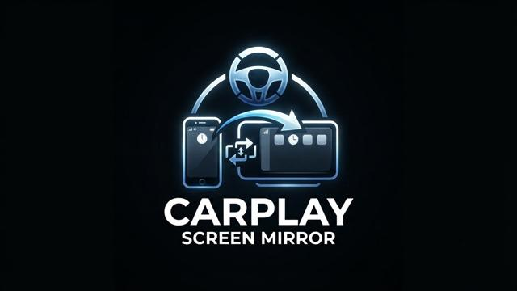

# Carplay Screen Mirror for Euro Truck Simulator 2

Bu eklenti, ETS 2 araçlarına herhangi bir masaüstü uygulamasını yansıtmanızı sağlayan modun çekirdek (DLL) dosyasıdır.

⚠️ **ÖNEMLİ BİLGİ:**
Modun tamamen çalışabilmesi için **ÖNCE** Steam Atölyesi'nden moda abone olmanız gerekmektedir!

👉 **[Steam Atölyesi Sayfasına Gitmek ve Abone Olmak İçin Tıklayın](https://steamcommunity.com/sharedfiles/filedetails/?id=3773481550)**

## Kurulum
1. Sağ taraftaki **Releases** bölümünden (veya doğrudan [buraya tıklayarak](https://github.com/tingoja/CarplayScreenMirror/releases/latest)) güncel ZIP dosyasını indirin.
2. ZIP içindeki CarplayScreenMirror.dll dosyasını kopyalayın.
3. Dosyayı oyunun kurulu olduğu dizindeki in/win_x64/plugins/ klasörüne atın.
4. Steam Atölyesinden moda abone olduğunuza emin olun ve oyuna girin!

---

This is the core plugin (DLL) file required for the Carplay Screen Mirror mod in ETS 2. This mod allows you to project any desktop application directly onto your truck's digital screens.

⚠️ **IMPORTANT REQUIREMENT:**
For this mod to work, you **MUST FIRST** subscribe to the mod on the Steam Workshop!

👉 **[Click Here to go to the Steam Workshop Page & Subscribe](https://steamcommunity.com/sharedfiles/filedetails/?id=3773481550)**

## Installation
1. Go to the **Releases** section on the right (or [click here](https://github.com/tingoja/CarplayScreenMirror/releases/latest)) and download the latest ZIP file.
2. Extract the CarplayScreenMirror.dll file from the ZIP.
3. Place the .dll file into your game's plugins directory: Steam/steamapps/common/Euro Truck Simulator 2/bin/win_x64/plugins/
4. Make sure you are subscribed on Steam Workshop, launch the game, and enjoy!
